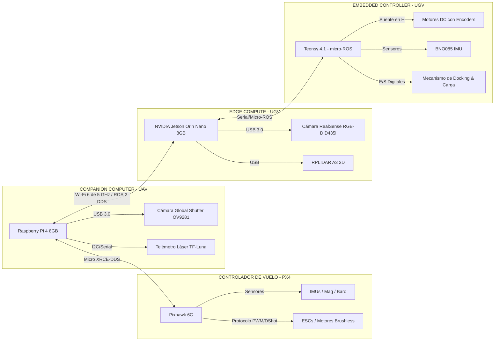
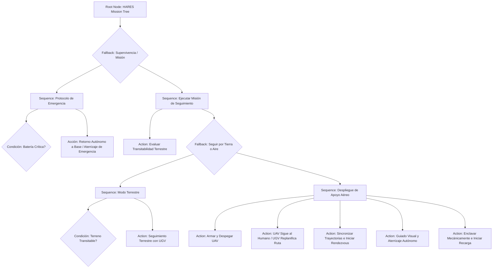
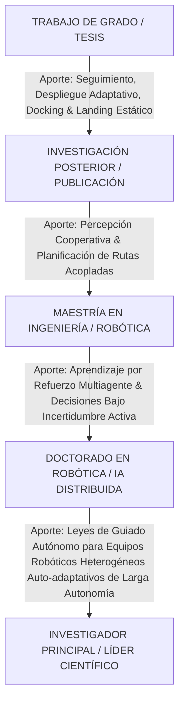

# Heterogeneous Adaptive Robotic Expedition System (HARES)
## Sistema Robótico Heterogéneo Adaptativo UAV–UGV para Seguimiento Autónomo de Personas y Continuidad de Misión en Terrenos Complejos

---

## 1. Títulos de Investigación Propuestos
* **Perspectiva de Aplicación:** *Sistema robótico heterogéneo adaptativo UAV–UGV para seguimiento autónomo de personas y continuidad de misión en terrenos complejos.*
* **Perspectiva Académica/Teórica:** *Coordinación adaptativa UAV–UGV para seguimiento humano bajo restricciones de transitabilidad, percepción, energía y aterrizaje sobre plataforma móvil.*

---

## 2. Resumen Ejecutivo del Proyecto
**HARES (Heterogeneous Adaptive Robotic Expedition System)** es un sistema robótico cooperativo compuesto por un **Rover Madre (UGV - Unmanned Ground Vehicle)** y un **Dron de Reconocimiento y Enlace (UAV - Unmanned Aerial Vehicle)** acoplable mecánicamente. El propósito fundamental del sistema es seguir autónomamente a un objetivo humano en entornos semiestructurados o naturales (ambientes no estructurados).

En condiciones operativas normales, el UGV lidera la misión terrestre utilizando visión artificial activa y sensores propioceptivos para mantener una trayectoria y distancia óptimas respecto al objetivo humano. No obstante, cuando los sensores de a bordo detectan que el terreno presenta obstáculos insalvables para una plataforma terrestre —tales como escaleras, pendientes excesivas, zanjas, escombros o fango—, el sistema evalúa dinámicamente el nivel de riesgo y la viabilidad del tránsito. 

Si la transitabilidad terrestre cae por debajo de un umbral seguro, la unidad de decisión táctica del UGV ordena el despliegue del UAV. El agente aéreo asume la responsabilidad del seguimiento visual continuo del humano, transmitiendo su estado y coordenadas en tiempo real al UGV, mientras que este replanifica su ruta terrestre para rodear el obstáculo insalvable. Una vez superada la discontinuidad del terreno y cuando ambos agentes convergen en una configuración espacial favorable, el UAV ejecuta una maniobra de aproximación (*rendezvous*) y aterrizaje autónomo de precisión (*precision landing*) sobre el Rover Madre, ya sea en estado estacionario o en movimiento de baja velocidad. Posteriormente, se activa un acoplamiento electromecánico seguro para proceder con la recarga de las baterías del UAV mediante la fuente de potencia principal del UGV.

La investigación no se limita al desarrollo mecánico y de control de los dos agentes individuales, sino que centra su núcleo científico en el estudio de **estrategias adaptativas de decisión y coordinación multiagente bajo restricciones**, determinando con precisión matemática *cuándo, cómo y bajo qué condiciones* un sistema heterogéneo debe cambiar su modalidad de locomoción para maximizar la continuidad de la misión.

---

## 3. Formulación del Problema de Investigación
Los robots terrestres (UGVs) ofrecen una autonomía de batería sustancialmente mayor, superior capacidad de carga útil y una robustez física considerable; sin embargo, su movilidad está estrictamente limitada por la topología del terreno y la presencia de obstáculos físicos tridimensionales. Por otro lado, los robots aéreos (UAVs) superan las limitaciones de transitabilidad terrestre con facilidad y ofrecen una perspectiva visual aérea privilegiada de gran amplitud, pero sufren de una autonomía energética drásticamente reducida (generalmente de 15 a 30 minutos), susceptibilidad a perturbaciones climáticas (como ráfagas de viento) y limitaciones severas en capacidad de procesamiento local y peso.

La integración cooperativa UAV-UGV busca precisamente fusionar las ventajas complementarias de ambas plataformas de locomoción para mitigar sus debilidades intrínsecas. No obstante, en la literatura científica actual persisten retos técnicos complejos relacionados con:
1. **Interoperabilidad y Comunicación Coherente:** El mantenimiento de enlaces de comunicación de baja latencia bajo condiciones dinámicas y no estructuradas de propagación.
2. **Coordinación y Sincronización Espacio-Temporal:** Planificación conjunta de trayectorias en espacios de búsqueda tridimensionales y bidimensionales acoplados.
3. **Decisión Autónoma de Cambio de Modalidad:** La ausencia de modelos formales y eficientes para decidir autónomamente el despliegue y repliegue de recursos aéreos basados en la incertidumbre de la percepción terrestre y la dinámica del terreno.
4. **Recuperación Autónoma:** El desafío mecánico, cinemático y perceptual de aterrizar un UAV de forma precisa sobre una plataforma móvil reducida en condiciones externas variables.

El problema central que aborda el proyecto HARES se puede sintetizar en la siguiente pregunta científica:
> **¿Cómo puede un sistema robótico heterogéneo determinar dinámicamente cuándo abandonar una estrategia de seguimiento terrestre, desplegar un agente aéreo de apoyo y posteriormente recuperar dicho agente de forma autónoma sin comprometer la continuidad y el éxito de la misión?**

---

## 4. Preguntas de Investigación
### Pregunta Principal
¿En qué medida una estrategia adaptativa de cooperación bidireccional UAV-UGV mejora la continuidad de misión, minimiza el tiempo de pérdida de contacto visual y optimiza la eficiencia energética del seguimiento autónomo de personas en entornos de transitabilidad variable frente a estrategias operativas exclusivamente terrestres?

### Preguntas Secundarias
1. **Percepción y Estimación de Terreno:** ¿De qué manera la fusión de visión RGB-D artificial y lecturas de sensores propioceptivos (corrientes de motores, IMU) permite estimar un índice cuantitativo de transitabilidad para predecir y anticipar fallas en la navegación terrestre del UGV?
2. **Toma de Decisiones Adaptativa:** ¿Qué formalismo matemático y computacional (máquinas de estado reactivas, árboles de comportamiento, o clasificadores basados en aprendizaje de máquina) representa de forma óptima el vector de estado multimodal del sistema:
   $$S_{t} = [d_{\text{persona}}, \mathcal{T}_{\text{terreno}}, E_{\text{batería}}, R_{\text{riesgo}}, C_{\text{comunicación}}, U_{\text{incertidumbre}}]$$
   para gatillar eficientemente el despliegue del UAV?
3. **Coordinación Multiagente:** ¿Cómo deben estructurarse las leyes de control cinemático y de seguimiento recíproco para que el UAV y el UGV coordinen de manera segura su movimiento, evitando colisiones mutuas mientras mantienen la continuidad del seguimiento del objetivo humano?
4. **Guiado y Aterrizaje de Precisión:** ¿Cómo se puede formular una ley de guiado predictivo visual para que el UAV estime en tiempo real la pose de la plataforma móvil del UGV y ejecute un aterrizaje autónomo seguro bajo ráfagas de viento, tanto en estado estacionario como a baja velocidad de traslación del Rover Madre?
5. **Aprendizaje y Adaptabilidad:** ¿Puede el sistema emplear técnicas de aprendizaje por refuerzo o aprendizaje online basado en datos de misiones previas para ajustar adaptativamente los umbrales de decisión del despliegue del UAV en escenarios no explorados?

---

## 5. Hipótesis Científicas
* **Hipótesis General ($H_1$):** La utilización de una estrategia adaptativa de coordinación heterogénea UAV-UGV reduce en al menos un **30% la pérdida acumulada de seguimiento visual del objetivo** ($T_{\text{lost}}$), reduce la distancia máxima de separación respecto a la persona ($D_{\text{max}}$) y optimiza el consumo energético general del sistema en misiones de larga duración con terrenos altamente accidentados, en comparación con una estrategia operativa basada únicamente en navegación terrestre.
* **Hipótesis Específica ($H_2$):** La incorporación de una ley de control predictivo basada en la estimación del estado cinemático relativo del UGV (posición, velocidad y aceleración instantánea) incrementa significativamente la tasa de éxito de aterrizaje autónomo del UAV sobre la plataforma y reduce el error de centrado radial en al menos un **40%**, en comparación con estrategias tradicionales puramente reactivas que solo consideran la posición visual instantánea de la plataforma.

---

## 6. Arquitectura del Sistema (Flujo Lógico y Físico)

```mermaid
graph TD
    %% Bloque de Percepción Humana
    H[PERSONA OBJETIVO] -->|Movimiento / Travectoria| S_Sensors[Sensores RGB / Depth / LiDAR]
    subgraph PERCEPCIÓN HUMANA (Edge Compute)
        S_Sensors --> Det[Detección de Persona: YOLO / RT-DETR]
        Det --> Est[Estimación de Distancia y Vector de Pose]
    end

    %% Bloque de Estado del Entorno
    Est --> Env[Evaluación de Estado de Entorno]
    subgraph ESTADO DEL ENTORNO
        Env --> Ter[Transitabilidad del Suelo: T_xy]
        Env --> Obs[Detección de Obstáculos 2D/3D]
        Env --> Unc[Estimación de Incertidumbre y Riesgo]
    end

    %% Bloque de Decisión Adaptativa
    Ter & Obs & Unc --> Decision[DECISIÓN ADAPTATIVA - BehaviorTree]
    
    %% Ramificación de Acciones
    Decision -->|Condiciones Seguras| GroundOnly[Modo Exclusivamente Terrestre]
    Decision -->|Obstáculo Insalvable / Riesgo Alto| DeployUAV[Comando: Despliegue de UAV]
    
    subgraph AGENTES INDIVIDUALES
        GroundOnly --> UGV[Control de Trayectoria UGV Madre]
        DeployUAV --> UAV_Launch[Despegue y Ascenso UAV]
        UAV_Launch --> UAV_Follow[Seguimiento Aéreo Autónomo UAV]
        UGV_Path[Replanificación de Ruta Terrestre UGV]
    end
    
    %% Bloque de Coordinación y Recuperación
    UAV_Follow --> Rend[Rendezvous Espacial UAV-UGV]
    UGV_Path --> Rend
    
    subgraph RECUPERACIÓN Y ACOPLAMIENTO
        Rend --> Guide[Guiado Visual de Precisión: ArUco / AprilTag]
        Guide --> Landing[Aterrizaje Autónomo Estacionario/Móvil]
        Landing --> Dock[Bloqueo Mecánico / Docking]
        Dock --> Charge[Transferencia de Energía y Recarga]
    end
    
    Charge --> Next[Actualización de Política / Continuidad de Misión]
    Next --> Decision
```

---

## 7. Propuesta Detallada de Hardware y Software

Para llevar a cabo el desarrollo experimental del sistema HARES con éxito y seguridad, se propone la siguiente selección de componentes de hardware y suite de software comercial y de código abierto orientada a robótica de nivel de investigación.



### 7.1. Especificaciones de Hardware Recomendadas

#### A. Plataforma Terrestre: Rover Madre (UGV)
* **Chassis de Locomoción:** Plataforma de tracción diferencial (Differential Drive) o tracción en las cuatro ruedas mediante deslizamiento (Skid-Steer) construida sobre perfiles de aluminio estructural anodizado. Debe contar con suspensión independiente en cada rueda (brazo de doble horquilla) para mitigar vibraciones que afecten las cámaras y el aterrizaje del dron.
* **Actuadores:** 4 Motores de corriente directa de imán permanente (DC Brushless o Brushed con caja reductora planetaria robusta de relación mínima 1:20), equipados con encoders ópticos o magnéticos de cuadratura de alta resolución (mínimo 1024 pulsos por revolución en el eje de salida) para garantizar una odometría terrestre altamente confiable.
* **Controladores de Motores:** Puente en H inteligente de doble canal (como el Sabertooth 2x32 o un controlador Roboteq SBL2360) capaz de manejar corrientes de pico de hasta 30A y soportar control dinámico por lazo cerrado de velocidad a nivel de hardware.
* **Batería de Potencia Principal:** Pack de baterías de Litio-Hierro-Fosfato (LiFePO4) o Iones de Litio (Li-Ion) de **24V (6S) con una capacidad mínima de 15Ah a 20Ah**. Esta fuente energética robusta alimentará los motores del UGV, las computadoras industriales de a bordo y suministrará energía al subsistema de recarga del UAV.
* **Mecanismo de Docking y Conectividad Física:**
  * **Estructura Cónica de Centrado Pasivo (Embudo):** Un diseño de embudo invertido impreso en 3D (PETG o Fibra de Carbono) que guíe las patas de aterrizaje del dron mecánicamente hacia el centro exacto de la plataforma de recarga.
  * **Contactos de Carga Autolubricantes y Flexibles:** Contactos tipo "Pogo Pins" de cobre de alta corriente instalados en la base del embudo para establecer conexión con los bornes del dron sin necesidad de un conector macho-hembra preciso.
  * **Sistema de Anclaje de Seguridad (Retención Física):** Un electroimán de neodimio compacto de baja potencia controlado digitalmente o un servoaccionador de alto torque que enclave físicamente las patas de aterrizaje del UAV una vez completado el docking, previniendo caídas accidentales durante la marcha del UGV por terrenos abruptos.

#### B. Plataforma Aérea: Dron de Apoyo (UAV)
* **Frame (Estructura):** Cuadricóptero compacto clase **330mm a 450mm** de fibra de carbono. Su tamaño debe ser lo suficientemente reducido como para poder aterrizar sobre el UGV de forma segura, pero con suficiente capacidad de carga para llevar la electrónica de compañía y sensores necesarios.
* **Planta de Propulsión:** Motores brushless de alta eficiencia (ej. motores 2212 de 920KV o motores 2306 de 1700KV para 4S) asociados con reguladores de velocidad electrónicos (ESCs) con firmware BLHeli_32 que admitan telemetría en tiempo real y protocolo DShot600. Hélices de alta eficiencia de 8 a 10 pulgadas o 5 pulgadas tripala según la configuración elegida.
* **Batería de Vuelo:** Pack de Polímero de Litio (LiPo) **4S (14.8V) de 2200mAh a 3500mAh** con una tasa de descarga sostenida de 30C-50C. Esto proveerá un tiempo neto de vuelo de entre 12 a 18 minutos con carga útil completa.
* **Controlador de Vuelo (Autopiloto):** **Pixhawk 6C** o **Holybro Pixhawk 4 mini** con procesador STM32H7, equipada con sensores inerciales duales o triples térmicamente compensados, magnetómetro externo de alta fidelidad y sensor barométrico para altitud de precisión.

#### C. Arquitectura Computacional de a Bordo (Sistemas de Cómputo)
* **UGV Edge Compute (Cerebro de Percepción Terrestre y Decisiones):** **NVIDIA Jetson Orin Nano (8GB Developer Kit)**. Proporciona hasta 40 TOPS de potencia de procesamiento de IA y aceleración por GPU por hardware, lo que permite ejecutar algoritmos de redes neuronales convolucionales para seguimiento humano (YOLOv8), segmentación semántica de transitabilidad de terreno y planificación avanzada de trayectorias (Nav2) en tiempo real con una frecuencia de refresco superior a los 30 FPS.
* **UGV Embedded Controller (Bajo Nivel):** Placa **Teensy 4.1 o ESP32-S3** que ejecuta un microcontrolador de alto rendimiento para interconectarse mediante micro-ROS con la computadora Jetson. Es responsable del lazo cerrado de control PID de los motores (a una frecuencia mínima de 100 Hz), lectura en tiempo real de odometría/IMU, monitoreo de voltajes mediante un sistema de gestión de baterías (BMS), y el control de los actuadores de docking y recarga.
* **UAV Companion Computer (Cerebro de Vuelo Autónomo y Visión del Dron):** **Raspberry Pi 4 Model B (4GB o 8GB de RAM)** o una placa **Jetson Orin Nano**. Su función principal es procesar las imágenes capturadas por la cámara inferior en tiempo real, estimar la pose relativa del marcador ArUco y ejecutar el nodo ROS 2 de guiado predictivo para el aterrizaje de precisión sobre el UGV, interactuando con el autopiloto mediante comandos offboard.

#### D. Sensores del Ecosistema
* **Cámara de Percepción Terrestre y Humana (UGV):** **Intel RealSense D435i** (cámara RGB-D estéreo activa) montada sobre un gimbal estabilizador motorizado de dos ejes. Genera nubes de puntos 3D de alta densidad indispensables para estimar la profundidad del objetivo humano y mapear obstáculos volumétricos inmediatos.
* **Sensor de Navegación Terrestre (UGV):** Escáner láser **LiDAR 2D RPLIDAR A3** (rango de detección de hasta 25 metros, tasa de muestreo de 16,000 puntos/segundo). Ofrece un barrido omnidireccional de 360 grados fundamental para algoritmos de SLAM, evasión rápida de obstáculos terrestres y localización precisa.
* **Percepción de Aterrizaje y Guiado (UAV):**
  * **Cámara Inferior de Obturador Global (Global Shutter Camera):** **Arducam OV9281 de alta velocidad (hasta 120 FPS, conexión USB 3.0 o MIPI CSI)**. Al carecer de deformaciones por "rolling shutter", esta cámara monocular captura imágenes perfectas y nítidas de los marcadores visuales del Rover Madre, calculando estimaciones de pose tridimensional libres de perturbaciones cinemáticas indeseadas.
  * **Telémetro Láser de Precisión (Altimetría Relativa):** Sensor láser monodireccional **TFmini Plus LiDAR** o **TF-Luna de Benewake** orientado hacia abajo. Provee lecturas continuas con precisión milimétrica de la altitud relativa del UAV respecto a la plataforma de aterrizaje, mitigando la deriva barométrica característica de altitudes menores a 1 metro.
  * **Sensor de Flujo Óptico (Optical Flow):** **PMW3901** integrado para permitir que el UAV mantenga una posición de vuelo estacionario estable y robusta (hovering) sin depender de la señal GPS ordinaria (muy propensa a ruido de rebote multitrayecto en áreas boscosas o estructuras altas).
* **Fusión Propioceptiva Embebida:** Unidades de medición inercial de alta gama (como el sensor **BNO085** que posee un procesador embebido para el cálculo directo de cuaterniones de rotación mediante fusión inercial) integradas tanto en el UGV como en el UAV para estabilizar lecturas de actitud.

---

### 7.2. Suite y Arquitectura de Software Recomendada

El ecosistema de software se basará enteramente en un arquitectura distribuida que corre sobre el sistema operativo robótico de segunda generación.

#### A. Capa de Sistema Operativo y Middleware
* **Sistema Operativo Principal:** **Ubuntu 22.04 LTS (Jammy Jellyfish)** instalado en los sistemas operativos de a bordo de ambas plataformas de desarrollo (Jetson y Raspberry Pi).
* **Middleware de Comunicaciones:** **ROS 2 Humble Hawksbill**. ROS 2 cuenta con el soporte nativo del estándar de comunicaciones industriales DDS (Data Distribution Service). Se implementará un transporte optimizado mediante **eProsima Fast DDS** o **Cyclone DDS**, configurando políticas de Calidad de Servicio (QoS) orientadas a asegurar la baja latencia (Best Effort) para el flujo continuo de estimaciones de pose, e interactividad confiable (Reliable / Transient Local) para el envío de comandos de estado críticos y alertas de misión.
* **Red Inalámbrica Dedicada:** Un enrutador de grado industrial Wi-Fi 6 de 5.8 GHz instalado a bordo del UGV para actuar como punto de acceso de baja latencia del sistema, permitiendo la interoperabilidad transparente de los nodos de ROS 2 en el UGV y en el UAV a través de la red local sin interferencias externas.
* **Firmware del Controlador Embebido Terrestre:** Framework **micro-ROS** integrado sobre el sistema operativo de tiempo real FreeRTOS en la placa Teensy 4.1/ESP32, el cual expone los controladores físicos del motor directamenente como tópicos nativos de ROS 2 (`/cmd_vel`, `/odom`, `/joint_states`) mediante un enlace serie de alta velocidad (UART a 921,600 baudios).

#### B. Software de Control y Autopiloto Aéreo (UAV)
* **Firmware del Autopiloto:** **PX4 Autopilot (versión 1.14+)** configurada en modo Quadcopter. PX4 cuenta con un cliente integrado para el estándar **Micro XRCE-DDS**, lo que posibilita una conexión bidireccional extremadamente ágil y nativa con el agente Micro XRCE-DDS que se ejecuta en la computadora de compañía (Raspberry Pi).
* **Control en Modo Offboard (Fuera de Bordo):** Se desarrollarán nodos en ROS 2 que se comuniquen a través del broker de DDS para publicar mensajes de la API offboard de PX4 (`VehicleCommand`, `TrajectorySetpoint`). Esto permite dictar trayectorias suaves en coordenadas tridimensionales de posición, velocidad o tasa de actitud, gestionando transiciones lógicas desde el despegue inicial autónomo hasta el acoplamiento final de manera remota e inteligente.

#### C. Subsistema de Visión Artificial y Percepción Computacional
* **Seguimiento Humano (Human Following):**
  * **Framework de Red Neuronal:** **YOLOv8-Nano / YOLOv10-Nano** entrenadas en el dataset de código abierto COCO para detección de personas. Las redes serán convertidas y compiladas utilizando el compilador optimizado de NVIDIA, **TensorRT**, lo que reducirá drásticamente la latencia de inferencia en la Jetson Orin Nano a menos de 8 ms por fotograma.
  * **Algoritmo de Rastreo (Tracking):** Implementación de **ByteTrack** para asignarle identificadores únicos a las personas detectadas en la imagen RGB. De este modo, se asocian las detecciones consecutivas de manera lógica en un vector temporal, evitando la pérdida del objetivo ante oclusiones mutuas temporales (como postes de luz, ramas finas o pasos peatonales).
* **Estimación de Pose para Aterrizaje:**
  * **Algoritmo de Marcadores Visuales:** Biblioteca **OpenCV ArUco** o paquete **AprilTag 3 / apriltag_ros**. El UAV detectará un patrón fiducial de ArUco de alta visibilidad o una matriz jerárquica de etiquetas (ej. un marcador ArUco grande con un marcador ArUco pequeño anidado en el centro) instalado físicamente sobre la plataforma de aterrizaje del UGV.
  * **Estimación de Pose 3D:** Mediante la función clásica de estimación SolvePnP con los parámetros de calibración intrínsecos preestablecidos de la lente de la cámara del dron, se computarán instantáneamente las matrices homogéneas de transformación para estimar la posición y orientación relativa exacta del centro de la plataforma con respecto al centro óptico del UAV a una frecuencia de 50 Hz.
* **Evaluación de Transitabilidad Terrestre (Terreno):**
  * **Enfoque Geométrico:** Mapeo de elevación basado en el procesamiento de nubes de puntos 3D de la cámara Intel RealSense empleando la biblioteca **Grid Map (ROS 2)**, que procesará y calculará en tiempo real un mapa de costos locales que representa la rugosidad física, varianza de altura y la pendiente del terreno circundante.
  * **Enfoque Semántico (Opcional/Avanzado):** Red neuronal convolucional ligera para segmentación semántica (como **Fast-SCNN** o **MobileNetV3-Seg** optimizada en TensorRT) para clasificar pixel a pixel la superficie terrestre entre clases discretas (concreto, tierra compacta, grava densa, pasto largo, escaleras, obstáculos verticales). Un mapa de costo probabilístico fusionará las lecturas geométricas y semánticas para obtener el índice de transitabilidad definitivo $T(x,y) \in [0,1]$.

#### D. Guiado, Planificación y Navegación Terrestre (UGV)
* **Pila de Navegación Terrestre:** **Nav2 (ROS 2 Navigation Stack)**. Se utilizará para orquestar la navegación autónoma global y local del UGV.
  * **Localización y SLAM:** Implementación de **Cartographer** de Google (SLAM basado en LIDAR 2D) o **RTAB-Map** (SLAM visual-inercial usando la cámara RealSense y la IMU) para construir de forma simultánea mapas navegables precisos y realizar la localización interna de la plataforma terrestre.
  * **Local Planner (Planificación Local):** Controlador predictivo basado en muestreo cinemático o el algoritmo de planificación elástica temporal **TEB Local Planner (Timed Elastic Band)** adaptado para ROS 2. Este planificador respeta las restricciones de los límites de velocidad y aceleración de la física del chasis diferencial, reaccionando dinámicamente frente a obstáculos que irrumpan súbitamente en la trayectoria planificada.

#### E. Control Predictivo de Aterrizaje Autónomo (UAV)
* Para superar la latencia inherente de las transmisiones inalámbricas y compensar los efectos aerodinámicos de acoplamiento del aire (efecto suelo y torbellino de la hélice), se estructurará una **ley de guiado predictivo basado en filtro de Kalman**:
  * Un **Filtro de Kalman Extendido (EKF)** se ejecutará en la Raspberry Pi del UAV para estimar el vector de estado cinemático del UGV (posición $x, y, z$, velocidad $\dot{x}, \dot{y}, \dot{z}$ y aceleración $\ddot{x}, \ddot{y}, \ddot{z}$) a partir de los datos históricos y las detecciones instantáneas del marcador ArUco.
  * Un controlador predictivo por modelo simplificado o una **ley de guiado proporcional interactiva de 3D** comandará las velocidades relativas necesarias para asegurar que el UAV descienda con una velocidad horizontal idéntica a la del UGV durante la fase final de aproximación, anulando el error relativo horizontal antes de tocar tierra física.

---

## 8. El Cerebro de HARES: Arquitectura Basada en BehaviorTree.CPP

En lugar de utilizar una máquina de estados finitos tradicional (que tiende a volverse inmanejable y rígida ante sistemas con múltiples fallos dinámicos), se propone implementar la lógica de control superior y asignación de tareas cooperativas del sistema HARES mediante **BehaviorTree.CPP (versión 4)**. 

Los Árboles de Comportamiento (Behavior Trees) proveen una estructura modular, altamente jerárquica y reactiva de ejecución, la cual evalúa de forma asíncrona un árbol compuesto de nodos condicionales, de acción y decoradores para comandar la misión robótica global.



### Descripción Lógica del Comportamiento:
1. **Verificaciones de Seguridad Continuas (Tics a 10 Hz):** El nodo raíz del árbol envía señales de ejecución periódicas. Lo primero que evalúa es la condición física básica del sistema (baterías del UAV y UGV, estado de los enlaces de comunicación, estado de sensores críticos). Si se detecta un fallo, el árbol interrumpe inmediatamente cualquier tarea y ejecuta el **Fallback de Emergencia** (ej. retorno inmediato al rover, o aterrizaje controlado del UAV).
2. **Evaluación de Transitabilidad ($T_{xy}$):** Durante la misión ordinaria, la acción de evaluación computa de forma continua la transitabilidad del entorno.
3. **Decisión Adaptativa de Despliegue:** Si el valor estimado de transitabilidad cae por debajo del umbral seguro establecido:
   $$\mathcal{T}_{\text{terreno}} < \mathcal{T}_{\text{threshold}}$$
   el subárbol de seguimiento terrestre devuelve un estado de falla (`FAILURE`). Esto obliga al nodo selector superior a saltar al subárbol de **Despliegue de Apoyo Aéreo**.
4. **Coordinación y Recuperación:** El dron despega, toma el control visual de la persona mientras el rover recalcula un camino alternativo seguro empleando Nav2. Cuando el rover se ubica nuevamente en un área segura plana, el nodo de aproximación (`Rendezvous`) coordina espacialmente a ambos agentes mediante estimaciones GPS o estimaciones de mapas locales compartidos, inicializando el nodo de aterrizaje visual de alta precisión para finalizar con el acoplamiento y recarga.

---

## 9. Entorno de Simulación y Pruebas Iniciales (Gazebo Sim)
Dado el riesgo físico inherente de colisiones durante las maniobras de acoplamiento aéreo-terrestre en etapas de desarrollo de software iniciales, es mandatorio iniciar el desarrollo con un **Entorno de Simulación de Alta Fidelidad**:
* **Herramientas Clave:** **Gazebo Sim (anteriormente Ignition)** y **PX4 Software-in-the-Loop (SITL)** integrado de forma nativa con ROS 2 Humble.
* **Flujo Operativo de Simulación:**
  1. Se importará un modelo URDF preciso del UGV que refleje fielmente su distribución de masas, geometría de chasis diferencial y las fricciones del contacto rueda-suelo.
  2. El modelo SDF del UAV simulará de forma aerodinámica la sustentación y las dinámicas físicas utilizando los plugins de motor y hélices de PX4 para Gazebo.
  3. Se diseñarán mundos virtuales en Gazebo que simulen de forma controlada terrenos variables (ej. un sendero liso que de repente se ve interrumpido por una escalera o una zona rocosa de escombros intransitables para el UGV), facilitando la verificación exhaustiva de la robustez lógica de los Behavior Trees y de las leyes de guiado visual antes de desplegar el código final en las computadoras Jetson y Raspberry Pi reales.

---

## 10. Estado del Arte Actual y Nicho de Contribución

### Comparativa Tecnológica del Estado del Arte

| Línea de Investigación | Estado del Arte Mundial (2023–2025) | Proyecto HARES (Nicho y Alcance) |
| :--- | :--- | :--- |
| **Seguimiento Humano con UGV** | Ampliamente desarrollado mediante redes de detección convolucionales tradicionales combinadas con filtros de estimación lineal (Kalman, etc.). | Utilizado como un bloque modular de entrada estándar para el seguimiento inicial del rover Madre terrestre. |
| **UAV Siguiendo Plataformas** | Demostrado experimentalmente utilizando odometría GPS compartida y control por visión directa. | Integrado bidireccionalmente: el UAV asume el seguimiento visual del humano e informa coordenadas estimadas de replanificación al UGV. |
| **Aterrizaje sobre Plataforma Terrestre** | Ampliamente investigado en configuraciones de laboratorios cerrados con cámaras VICON de captura de movimiento externa. | Aterrizaje autónomo en exteriores semiestructurados utilizando cámaras de a bordo (Onboard Sensors) y procesamiento de visión embebido en tiempo real. |
| **Aterrizaje en Plataformas Móviles** | Temática de investigación muy activa (2024-2025) empleando leyes de guiado predictivas, compensación de ráfagas y visión monocular. | Implementación experimental del aterrizaje en movimiento lento en exteriores con estimación cinemática del movimiento del UGV mediante EKF local. |
| **Dynamic Task Allocation (Asignación)** | Investigado teóricamente bajo la disciplina de investigación operativa o algoritmos de asignación centralizados. | Lógica de decisión adaptativa descentralizada descentrada a bordo en tiempo real basada en árboles de comportamiento dinámicos y mapas de transitabilidad física. |
| **Cambio Dinámico de Locomoción** | Menos explorado en ambientes reales debido a la complejidad de integración física, acoplamiento y control cooperativo. | **Núcleo de contribución científica del proyecto:** Integración en un único sistema físico continuo y autoadaptativo que maximiza la continuidad de misión mediante conmutación espacial terrestre/aérea. |

---

## 11. Estructura Temporal del Proyecto (Cronograma de 16 Semanas)

Para un semestre académico estructurado de 16 semanas, se define la siguiente hoja de ruta de desarrollo incremental para asegurar el cumplimiento seguro de los objetivos:

```mermaid
gantt
    title Plan de Trabajo Detallado de HARES (16 Semanas)
    dateFormat  X
    axisFormat Semana %H

    section Fase 1: Estado del Arte & Simulador
    Estudio del Arte y Definición Teórica   :active, des1, 0, 2
    Modelado SDF/URDF y Simulación Gazebo :active, des2, 1, 3
    
    section Fase 2: Plataforma Rover (UGV)
    Montaje de Chasis y Controladores DC   :active, des3, 2, 5
    Fusión de Odometría, IMU y Nav2 :active, des4, 4, 6
    
    section Fase 3: Percepción & Detección
    Detección Humana con YOLO en Jetson    :active, des5, 5, 7
    Análisis de Transitabilidad del Suelo   :active, des6, 6, 8
    
    section Fase 4: Plataforma Aérea (UAV)
    Calibración de PX4, Flujo Óptico y RPi :active, des7, 7, 9
    Guiado Visual con Marcador ArUco    :active, des8, 8, 10
    
    section Fase 5: Integración Cooperativa
    Árboles de Comportamiento e Integración:active, des9, 9, 12
    Aterrizaje Estacionario en Simulador y Real :active, des10, 11, 13
    
    section Fase 6: Pruebas y Análisis
    Pruebas Físicas de Cambio de Modalidad :active, des11, 12, 15
    Análisis de Métricas y Redacción de Tesis:active, des12, 14, 16
```



### 11.1. Detalle del Trabajo por Semanas
* **Semanas 1–2: Fase de Diseño y Simulación Virtual**
  * Revisión bibliográfica exhaustiva sobre aterrizaje móvil coordinado y algoritmos de transitabilidad.
  * Configuración inicial del entorno ROS 2 Humble. Modelado tridimensional del UGV y el UAV en archivos URDF/SDF compatibles con Gazebo Sim. Pruebas iniciales de Software-In-The-Loop (SITL).
* **Semanas 3–5: Construcción Mecánica e Integración de Software del UGV**
  * Ensamblaje físico del chasis del Rover, controladores de motores, actuadores y baterías.
  * Programación de la Teensy 4.1 con micro-ROS para odometría de precisión. Integración de la Jetson Orin Nano, el LIDAR RPLIDAR A3 y la cámara RealSense.
  * Configuración y sintonización de Nav2 en el Rover para mapeo local y evasión de obstáculos.
* **Semanas 6–7: Módulos de Visión y Percepción**
  * Despliegue de YOLOv8 optimizado en TensorRT en la Jetson para la detección de personas.
  * Desarrollo del algoritmo de análisis de transitabilidad a partir de nubes de puntos RGB-D y LiDAR. Creación de mapas de costos locales interactivos.
* **Semanas 8–9: Configuración y Control Autónomo del UAV**
  * Montaje físico del cuadricóptero, calibración del autopiloto Pixhawk con PX4 Autopilot.
  * Integración de la Raspberry Pi 4 de compañía con sensores ópticos de rango y flujo óptico para garantizar un vuelo estable autónomo sin GPS (GPS-Denied Navigation).
* **Semanas 10–11: Enlace ROS 2, Rendezvous y Pruebas de Guiado Visual**
  * Configuración del enlace DDS de comunicación Wi-Fi de alta velocidad para transmisión remota compartida.
  * Desarrollo del nodo de detección de marcadores ArUco/AprilTag a 50 Hz en la Raspberry Pi 4.
  * Pruebas de guiado de aproximación y simulación de aterrizaje autónomo del UAV en la simulación Gazebo.
* **Semanas 12–13: Lógica Central de BehaviorTree e Integración Completa**
  * Programación del árbol de comportamiento global en la computadora Jetson utilizando BehaviorTree.CPP v4.
  * Pruebas experimentales iniciales del aterrizaje autónomo sobre el UGV estacionario en un entorno físico de exterior controlado (sin viento extremo).
* **Semanas 14–15: Experimentos de Campo Abierto y Ajustes Avanzados**
  * Ejecución de pruebas dinámicas completas: el Rover Madre sigue al humano, detecta una discontinuidad simulada del terreno, decide el despliegue del UAV, el UAV continúa el seguimiento, el UGV replanifica su trayectoria terrestre, rendezvous espacial, aterrizaje autónomo estático (y dinámico a baja velocidad como objetivo ambicioso) y acoplamiento exitoso.
  * Recolección sistemática del dataset de telemetría de misiones para análisis de métricas.
* **Semana 16: Análisis de Datos, Métricas y Cierre**
  * Procesamiento de datos de telemetría. Cálculo cuantitativo de indicadores clave RMSE de posición, tasas de éxito y eficiencias de misión.
  * Redacción final de la documentación técnica del proyecto, redacción del artículo de investigación y defensa académica del proyecto de tesis.

---

## 12. Delimitación del Alcance del Semestre

### Entregables Obligatorios (Compromiso del Semestre)
* [ ] **UGV Autónomo Funcional:** Capacidad de seguir a una persona en exteriores planos utilizando YOLOv8 y la cámara RealSense.
* [ ] **Navegación Nav2:** Localización integrada y evasión autónoma de obstáculos locales utilizando el escáner LIDAR 2D.
* [ ] **Detección Dinámica de Transitabilidad:** Algoritmo que clasifica el nivel de transitabilidad del suelo circundante e identifica obstáculos insalvables para el rover.
* [ ] **Control Basado en Behavior Trees:** Árbol de comportamiento reactivo en BehaviorTree.CPP v4 que gestiona la coordinación de la misión completa.
* [ ] **Estrategia de Despliegue de UAV:** Interfaz de despegue y telemetría autónoma para ordenar de forma asincrónica el despliegue del UAV en el instante óptimo.
* [ ] **Aterrizaje Autónomo Estacionario:** Capacidad repetible del UAV de aproximarse y aterrizar físicamente de forma autónoma sobre la plataforma del UGV quieto utilizando marcadores ArUco y guiado visual.
* [ ] **Dataset y Evaluación Cuantitativa:** Archivos de registro ROS 2 (`rosbag2`) que demuestren de forma medible la mejora de las métricas de continuidad de misión.

### Objetivos Ambiciosos (Frontera de Investigación)
* [ ] **Aterrizaje en Plataforma Terrestre Móvil:** Descenso exitoso del UAV mientras el UGV se traslada en línea recta a baja velocidad constante ($\le 0.5 \text{ m/s}$).
* [ ] **Clasificador Basado en Machine Learning para Despliegue:** Modelo de aprendizaje supervisado (ej. SVM o red neuronal densa simple) que predice la idoneidad del despliegue del UAV minimizando el gasto de batería agregado del sistema.

### Extensiones Futuras (Proyectos Posteriores / Maestría)
* [ ] **Modelos de Percepción Cooperativa:** Fusión de mapas de costo locales generados por el UGV con mapas visuales aéreos globales tomados por el UAV en vuelo para una exploración enjambre superior.
* [ ] **Aprendizaje Online por Refuerzo:** Ajuste autónomo de las políticas del Behavior Tree a través de interacciones continuas con terrenos dinámicos.
* [ ] **Aterrizaje Predictivo Complejo:** Leyes de control predictivas basadas en dinámica de fluidos para contrarrestar turbulencias extremas en el docking.

---

## 13. Métricas de Evaluación Científica

Para evaluar cuantitativamente el desempeño del sistema y sustentar de forma académica las hipótesis planteadas, se registrarán las siguientes variables físicas e informáticas en cada misión de prueba:

1. **Métricas de Seguimiento Visual ($RMSE$):**
   * **Error de Distancia Relativa ($RMSE_d$):** Desviación cuadrática media de la distancia real mantenida con respecto a la distancia deseada del objetivo humano ($d^* = 2.0\text{ m}$):
     $$RMSE_d = \sqrt{\frac{1}{N}\sum_{i=1}^{N} (d_i - d^*)^2}$$
   * **Error Angular ($RMSE_\theta$):** Error cuadrático medio de la orientación del robot respecto a la línea visual directa del humano ($e_\theta = \theta_i - \theta^*$).
2. **Métricas de Continuidad de Misión:**
   * **Tiempo de Pérdida de Seguimiento ($T_{\text{lost}}$):** Tiempo acumulado en segundos durante el cual el sistema robótico completo (tanto UGV como UAV) pierde contacto visual con el objetivo humano debido a oclusiones, límites de sensor o fallos de orientación.
   * **Separación Máxima ($D_{\text{max}}$):** Distancia máxima instantánea registrada entre la persona y el agente activo más cercano del sistema.
3. **Métricas de Navegación Terrestre:**
   * **Longitud del Trayecto Terrestre ($Path_{\text{length}}$):** Distancia total en metros recorrida por las ruedas del UGV para completar el seguimiento y superar el obstáculo.
   * **Tasa de Colisiones ($Collision_{\text{rate}}$):** Número de contactos físicos no deseados del rover con obstáculos físicos por unidad de tiempo de misión.
4. **Métricas de Recuperación Aérea (Landing):**
   * **Tasa de Éxito de Aterrizaje ($Landing_{\text{rate}}$):** Porcentaje de maniobras de aproximación visual que finalizan con el UAV en contacto físico directo estable sobre el área interna de recarga de la plataforma sin intervención manual.
   * **Error de Centrado Radial ($e_{\text{radial}}$):** Distancia euclidiana bidimensional entre el centro geométrico del UAV aterrizado y el centro de la plataforma de recarga del UGV:
     $$e_{\text{radial}} = \sqrt{(x_{\text{drone}} - x_{\text{platform}})^2 + (y_{\text{drone}} - y_{\text{platform}})^2}$$
5. **Métricas de Eficiencia Energética:**
   * **Consumo de Energía Total de la Misión ($Energy_{\text{total}}$):** Energía consumida agregada medida en Joules (o Watt-hora) por ambos robots a lo largo de la prueba:
     $$Energy_{\text{total}} = \int (V_{\text{ugv}}(t) \cdot I_{\text{ugv}}(t) + V_{\text{uav}}(t) \cdot I_{\text{uav}}(t)) dt$$

---

## 14. Impactos Esperados del Proyecto

### 14.1. Impacto Científico
La investigación generará evidencia empírica clave sobre la **autoadaptabilidad de los sistemas de transporte multiagente heterogéneos**. Abordará el problema general de cómo coordinar agentes con dinámicas físicas y restricciones cinemáticas sustancialmente diferentes para cooperar en tareas críticas continuas bajo entornos con alta degradación de la transitabilidad y la percepción. Los resultados aportarán metodologías y algoritmos valiosos para la robótica adaptativa y la inteligencia artificial distribuida de a bordo.

### 14.2. Impacto Tecnológico y Sectores de Aplicación
La arquitectura adaptable y el concepto modular desarrollados en HARES se extienden naturalmente a diversos sectores tecnológicos de alto valor estratégico e industrial:
* **Búsqueda y Rescate en Zonas de Desastre:** El UGV sirve como un centro base robusto de comunicaciones de largo alcance y transporte de suministros médicos, mientras que el UAV se despliega dinámicamente para inspeccionar grietas, techos inestables o áreas aisladas por escombros inaccesibles para el transporte terrestre.
* **Inspección de Infraestructura Crítica:** El Rover recorre de forma autónoma vías o pasillos internos en plantas industriales o de generación de energía, y lanza al UAV para inspeccionar estructuras elevadas, puentes de tuberías o techos, retornando y acoplándose de manera automática para cargarse y continuar su patrullaje de vigilancia regular de forma ininterrumpida.
* **Agricultura de Precisión Inteligente:** El UGV transporta herramientas de intervención física terrestre pesadas, actuadores de labranza o tanques de fertilización, mientras que el UAV se despliega periódicamente para realizar mapeos multiespectrales aéreos rápidos de grandes extensiones de cultivo, localizando focos de plagas o áreas con estrés hídrico específico para guiar de manera coordinada la trayectoria del Rover.
* **Logística Portuaria y de Almacenes:** Equipos heterogéneos que colaboran de manera autónoma para inventariado y manipulación de contenedores de carga, donde el dron provee perspectivas visuales tridimensionales elevadas para la automatización total de grúas y vehículos terrestres guiados (AGVs).

### 14.3. Impacto Académico y Proyección a Largo Plazo
Este proyecto representa un punto de partida estratégico excelente para el desarrollo de un plan de investigación de largo aliento con escalabilidad directa hacia estudios de posgrado de alta especialidad técnica (Maestría y Doctorado):



* **Trabajo de Grado (Pregrado):** Desarrollo del prototipo físico integrado, calibración del lazo de control PID embebido, control de navegación Nav2, seguimiento básico mediante YOLO y landing visual estacionario preciso.
* **Estudio de Maestría:** Implementación avanzada de **percepción cooperativa** (construcción mutua de mapas de costo dinámicos entre el UAV y el UGV) e incorporación de **aprendizaje por refuerzo profundo** para optimizar el instante óptimo de transición adaptativa basándose en la incertidumbre de la transitabilidad percibida.
* **Investigación Doctoral:** Formulación matemática avanzada de leyes de guiado predictivas para equipos heterogéneos escalables de múltiples agentes cooperantes en escenarios caóticos con degradación de la red de comunicación, autoorganización descentralizada de tareas y resiliencia robótica de larga duración frente a fallos catastróficos en el hardware físico de cualquiera de los agentes.

---

## 15. Referencias Clave para la Fase de Investigación Inicial

* **Shahar, S. M. et al. (2025).** *"UGV-UAV Integration Advancements for Coordinated Missions: A Review"*. Una referencia excelente para comprender los desafíos de interoperabilidad, enlaces de comunicación robustos y las arquitecturas de software de comunicación cruzada para misiones multiagente coordinadas.
* **Sensors (2023).** *"Vision-Based Autonomous Following of a Moving Platform and Landing for an Unmanned Aerial Vehicle"*. Uno de los artículos más citados sobre el desarrollo práctico de algoritmos de guiado visual y sintonización de leyes de control en cascada para el guiado final de drones sobre rovers terrestres mediante cámaras monoculares y marcadores ArUco.
* **IEEE Transactions on Robotics (2025).** *"Heterogeneous Multirobot Task Allocation for Long-Endurance Missions in Dynamic Scenarios"*. Publicación científica idónea para sustentar y estructurar teóricamente la sección de asignación de tareas cooperativas dinámicas, justificando el uso de árboles de comportamiento e inteligencia adaptativa.
* **VTOL UAVs Landing Systems (2024/2025).** *"Vision-Based Optimal Landing Guidance Law for VTOL UAVs on a Moving Platform"*. Trabajo teórico clave para la implementación de las leyes de guiado cinemático proporcional de 3D necesarias para el aterrizaje dinámico preciso y compensación del movimiento de plataforma móvil.
* **Drones (2025).** *"High-Precision Landing on a Moving Platform Based on Drone Vision Using YOLO Algorithm"*. Estudio tecnológico actual que aborda de manera robusta el uso de detectores basados en redes YOLO livianas para la localización y seguimiento de plataformas móviles, complementando el uso tradicional de marcadores fiduciales de ArUco.
* **Comprehensive Robotic Reviews (2025).** *"Vision-Based Autonomous UAV Landing: A Comprehensive Review of Technologies, Techniques, and Applications"*. Un estudio sistemático riguroso que analiza con detalle científico un total de 143 publicaciones académicas de primer nivel sobre aterrizajes de precisión basados en visión autónoma entre los años 2018 y 2025, idóneo para redactar el estado del arte de la tesis académica.
