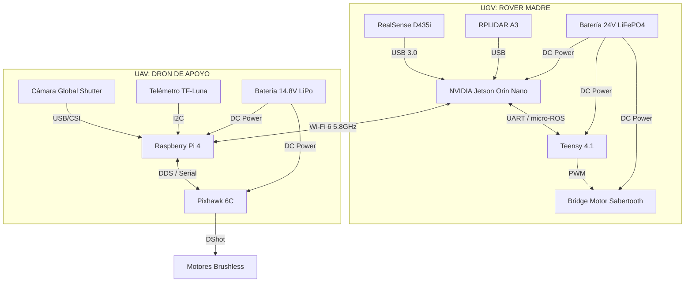

# [ HARES v2 ] - Guía de Implementación Física
## De la Simulación Táctica al Mundo Real: Manual de Construcción y Scaffolding de Software

---

## 1. El Salto Tecnológico: ¿Qué cambia en v2?

En la fase anterior (v1), validamos la lógica de decisión mediante una simulación 2D reactiva. En **HARES v2**, el objetivo es la construcción de los agentes físicos y la integración de sensores reales bajo una arquitectura distribuida **ROS 2 Humble**.

| Componente | v1 (Simulación) | v2 (Mundo Físico) |
| :--- | :--- | :--- |
| **Middleware** | JavaScript Event Loop | **ROS 2 Humble (Fast DDS)** |
| **Cerebro UGV** | `updateSimulation()` | **NVIDIA Jetson Orin Nano** |
| **Detección** | Coordenadas Directas | **YOLOv8 + Intel RealSense D435i** |
| **Navegación** | Pathfinding 2D Simple | **Nav2 + RPLIDAR A3 + Odometría** |
| **Control Dron** | Interpolación de Pose | **PX4 Autopilot + Mavros/DDS Agent** |
| **Docking** | Lógica de Proximidad | **ArUco Markers + Guiado de Precisión** |

---

## 2. Diagrama de Conectividad Electrónica v2

Este es el esquema de cableado y protocolos que debes seguir para ensamblar el sistema físico:



---

## 3. Scaffolding del Espacio de Trabajo (Workspace)

Para llevar esto al mundo físico, el primer paso es estructurar el código en paquetes de ROS 2. He diseñado esta estructura modular para que puedas trabajar en cada subsistema de forma independiente.

### Estructura de Directorios Propuesta (`hares_ws`):

```text
hares_ws/
├── src/
│   ├── hares_bringup/          # Launch files para arrancar todo el sistema
│   ├── hares_perception/       # Nodos de YOLOv8 y procesamiento de ArUco
│   ├── hares_control/          # El "Cerebro" (Behavior Trees)
│   ├── hares_navigation/       # Configuración de Nav2 y SLAM
│   ├── hares_uav_bridge/       # Interfaz con PX4 (Mavros o Micro-DDS)
│   ├── hares_interfaces/       # Mensajes y Servicios personalizados (.msg, .srv)
│   └── hares_description/      # Modelos URDF y mallas 3D para visualización en RViz
└── GEMINI.md                   # Instrucciones específicas del repositorio
```

---

## 4. Guía de Selección de Componentes Críticos (BOM v2)

Para asegurar que el sistema sea capaz de realizar el docking autónomo, te recomiendo estos componentes específicos:

### 4.1. El Chasis del Rover (UGV)
*   **Recomendación:** Chasis de aluminio 6061 con tracción 4WD y **suspensión de amortiguadores de aceite**.
*   **Por qué:** Sin suspensión, las vibraciones del terreno harán que la cámara de profundidad (D435) y el marcador de aterrizaje vibren demasiado, provocando que el dron pierda el "lock" visual durante la aproximación.

### 4.2. La Cámara del Dron (UAV)
*   **Recomendación:** **Arducam OV9281 (Global Shutter)**.
*   **Por qué:** Las cámaras normales (Rolling Shutter) deforman la imagen cuando el dron se mueve rápido o vibra. El Global Shutter captura el marcador ArUco sin distorsión, permitiendo una estimación de pose perfecta a 60-120 FPS.

### 4.3. El Sistema de Docking
*   **Recomendación:** Mecanismo de **Embudo de Centrado Pasivo** + **Cierre por Electroimán**.
*   **Diseño:** Imprime en 3D una base cónica de unos 30cm de diámetro. Cuando las patas del dron entran en el cono, la gravedad lo centra físicamente. Un sensor de presión o de contacto activa un electroimán de 5V para que el dron no se caiga si el rover frena de golpe.

---

## 5. Próximos Pasos Técnicos (Tu Hoja de Ruta)

1.  **Instalación Base:** Instalar Ubuntu 22.04 y ROS 2 Humble en tu PC de desarrollo y en las tarjetas Jetson/Raspberry.
2.  **Calibración Extrínseca:** Es vital calibrar la posición exacta de la cámara respecto al centro del robot (Transformadas TF2).
3.  **Tuning de PX4:** Realizar vuelos de prueba en modo `Position` para asegurar que el dron es estable antes de intentar el control `Offboard` desde ROS 2.
4.  **Pruebas de ArUco:** Probar la detección del marcador desde el dron a diferentes alturas (3m, 2m, 1m) y verificar que el error de posición reportado sea menor a 2-3 cm.

---

## 6. Configuración de ROS 2 para HARES v2

A continuación, presento un ejemplo de cómo se vería el archivo de lanzamiento (`launch file`) principal para arrancar el sistema en el rover:

```python
# hares_ws/src/hares_bringup/launch/hares_full_system.launch.py

from launch import LaunchDescription
from launch_ros.actions import Node

def generate_launch_description():
    return LaunchDescription([
        # 1. Percepción: YOLOv8 Tracking
        Node(
            package='hares_perception',
            executable='yolo_tracker_node',
            name='human_tracker',
            parameters=[{'model_path': 'yolov8n.engine'}]
        ),
        
        # 2. Navegación: Nav2 Stack
        # (Aquí se cargaría el archivo de configuración de Nav2)
        
        # 3. Control: Behavior Tree Manager
        Node(
            package='hares_control',
            executable='bt_manager_node',
            name='hares_brain',
            output='screen'
        ),
        
        # 4. Comunicación con Dron
        Node(
            package='hares_uav_bridge',
            executable='px4_offboard_control',
            name='uav_interface'
        )
    ])
```

---

### ¡HARES v2 está listo para ser construido!
Esta guía física complementa tu documentación académica. Con los planos de hardware y la estructura de software definidos, puedes empezar a adquirir componentes y configurar tu entorno de desarrollo real.
